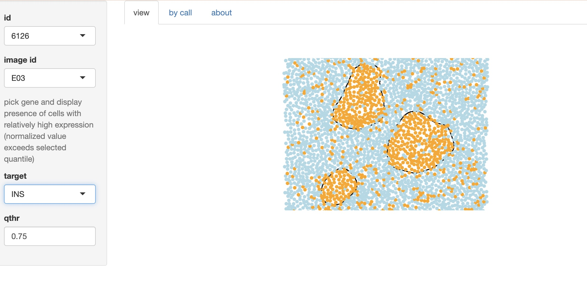
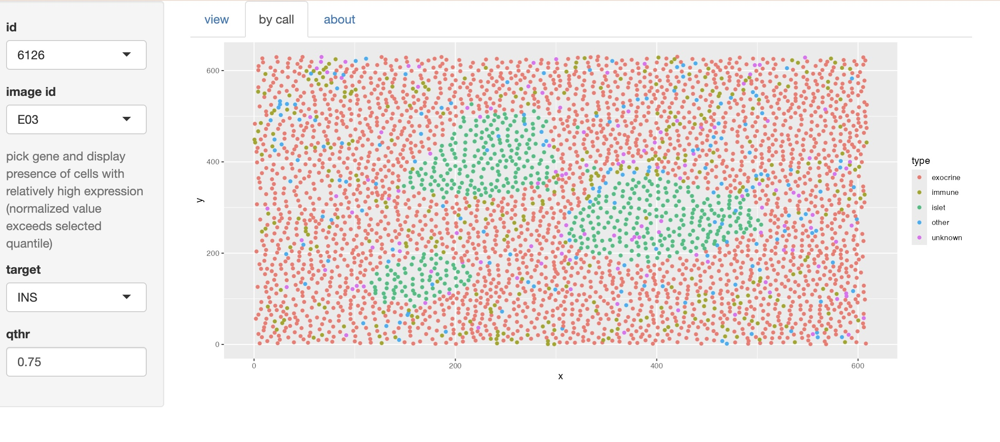
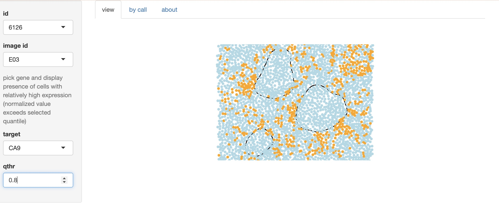

# sostaExtras

Define a simple app to overview some spatialExperiment examples from [sosta](https://bioconductor.org/packages/sosta)  package

## Basic view

use `example(surveyDamond, ask=FALSE)` to start the app after successful installation
via `BiocManager::install("vjcitn/sostaExtras")`

Change the initial 'target' selection to 'INS'

## Cell type view tab

## A different target, filtered by relative 'abundance' level

Note that the qthr control can be used to 'decolor' cells that
have target abundance measure below the selected quartile of
the target
